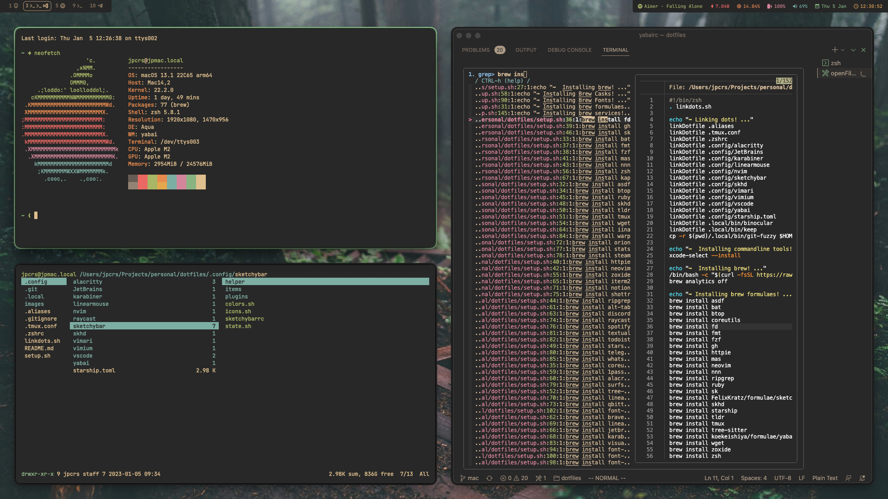

My messy Mac dotfiles.

## Details
WM: [yabai](https://github.com/koekeishiya/yabai)

Shortcuts: [skhd](https://github.com/koekeishiya/skhd) / [Karabiner](https://github.com/pqrs-org/Karabiner-Elements)

Bar: [Sketchybar](https://github.com/FelixKratz/SketchyBar)

Terminal: [alacritty](https://github.com/alacritty/alacritty)

Launcher: [Raycast](https://www.raycast.com/)

File Manager: [ranger](https://github.com/ranger/ranger) / [nnn](https://github.com/jarun/nnn)

## Vim Emulation Shortcuts

| Base Commands      | Description        | Visual Studio Code                         | JetBrains |
| ------------------ | ------------------- | ------------------------------------------ | --------- |
| `<leader>`         | Show whichkey       | `whichkey.show`                            | `WIP`     |
| `<leader><leader>` | Show command list   | `workbench.action.showCommands`            | `WIP`     |
| `<leader> J`       | Jump to a word      | `easymotion.sequence`                      | `WIP`     |
| `<leader> j`       | Jump to a character | `easymotion.character`                     | `WIP`     |
| `<leader> N`       | Clear notifications | `notifications.clearAll`                   | `WIP`     |
| `<leader> e`       | Toggle Sidebar      | `workbench.action.toggleSidebarVisibility` | `WIP`     |

| Buffer Commands  | Description                 | Visual Studio Code                                                                                                      | JetBrains |
| ---------------- | --------------------------- | ----------------------------------------------------------------------------------------------------------------------- | --------- |
| `<leader> b h`   | Move Buffer to Left Group   | `workbench.action.moveEditorToLeftGroup`                                                                                | `WIP`     |
| `<leader> b j`   | Move Buffer to Bottom Group | `workbench.action.moveEditorToBelowGroup`                                                                               | `WIP`     |
| `<leader> b k`   | Move Buffer to Top Group    | `workbench.action.moveEditorToAboveGroup`                                                                               | `WIP`     |
| `<leader> b l`   | Move Buffer to Right Group  | `workbench.action.moveEditorToRightGroup`                                                                               | `WIP`     |
| `<leader> b n`   | New Buffer                  | `workbench.action.files.newUntitledFile`                                                                                | `WIP`     |
| `<leader> b p`   | Paste Whole Buffer          | `ggVGp`                                                                                                                 | `WIP`     |
| `<leader> b t`   | Pin Buffer                  | `workbench.action.pinEditor`                                                                                            | `WIP`     |
| `<leader> b T`   | Unpin Buffer                | `workbench.action.unpinEditor`                                                                                          | `WIP`     |
| `<leader> b y`   | Yank Whole Buffer           | `ggVGy`                                                                                                                 | `WIP`     |
| `<leader> b n h` | New Buffer Left             | `workbench.action.splitEditorLeft` && `workbench.action.files.newUntitledFile` && `workbench.action.closeOtherEditors`  | `WIP`     |
| `<leader> b n j` | New Buffer Down             | `workbench.action.splitEditorDown` && `workbench.action.files.newUntitledFile` && `workbench.action.closeOtherEditors`  | `WIP`     |
| `<leader> b n k` | New Buffer Up               | `workbench.action.splitEditorUp` && `workbench.action.files.newUntitledFile` && `workbench.action.closeOtherEditors`    | `WIP`     |
| `<leader> b n l` | New Buffer Right            | `workbench.action.splitEditorRight` && `workbench.action.files.newUntitledFile` && `workbench.action.closeOtherEditors` | `WIP`     |

| Debug Commands   | Description                       | Visual Studio Code                                     | JetBrains |
| ---------------- | --------------------------------- | ------------------------------------------------------ | --------- |
| `<leader> d c`   | Continue                          | `workbench.action.debug.continue`                      | `WIP`     |
| `<leader> d C`   | Run to Cursor                     | `editor.debug.action.runToCursor`                      | `WIP`     |
| `<leader> d i`   | Step Into                         | `workbench.action.debug.stepInto`                      | `WIP`     |
| `<leader> d j`   | Jump to Cursor                    | `debug.jumpToCursor`                                   | `WIP`     |
| `<leader> d h`   | Debug Hover                       | `editor.debug.action.showDebugHover`                   | `WIP`     |
| `<leader> d o`   | Step Over                         | `workbench.action.debug.stepOver`                      | `WIP`     |
| `<leader> d O`   | Step Out                          | `workbench.action.debug.stepOut`                       | `WIP`     |
| `<leader> d p`   | Pause                             | `workbench.action.debug.pause`                         | `WIP`     |
| `<leader> d R`   | Restart                           | `workbench.action.debug.restart`                       | `WIP`     |
| `<leader> d r`   | Run without Debugging             | `workbench.action.debug.run`                           | `WIP`     |
| `<leader> d s`   | Start Debugging                   | `workbench.action.debug.start`                         | `WIP`     |
| `<leader> d S`   | Stop Debugging                    | `workbench.action.debug.stop`                          | `WIP`     |
| `<leader> d v`   | View Repl                         | `workbench.debug.action.toggleRepl`                    | `WIP`     |
| `<leader> d w`   | View Watch                        | `workbench.debug.action.focusWatchView`                | `WIP`     |
| `<leader> d b b` | Add Breakpoint                    | `editor.debug.action.toggleBreakpoint`                 | `WIP`     |
| `<leader> d b c` | Add Conditional Breakpoint        | `editor.debug.action.conditionalBreakpoint`            | `WIP`     |
| `<leader> d b d` | Delete Breakpoint                 | `debug.removeBreakpoint`                               | `WIP`     |
| `<leader> d b D` | Remove All Breakpoints            | `workbench.debug.viewlet.action.removeAllBreakpoints`  | `WIP`     |
| `<leader> d b e` | Enable All Breakpoints            | `workbench.debug.viewlet.action.enableAllBreakpoints`  | `WIP`     |
| `<leader> d b E` | Disable All Breakpoints           | `workbench.debug.viewlet.action.disableAllBreakpoints` | `WIP`     |
| `<leader> d b n` | Next Breakpoint                   | `editor.debug.action.goToNextBreakpoint`               | `WIP`     |
| `<leader> d b p` | Previous Breakpoint               | `editor.debug.action.goToPreviousBreakpoint`           | `WIP`     |
| `<leader> d b s` | Enable/Disable(Switch) Breakpoint | `debug.enableOrDisableBreakpoint`                      | `WIP`     |

| File Commands  | Description           | Visual Studio Code                                | JetBrains |
| -------------- | --------------------- | ------------------------------------------------- | --------- |
| `<leader> f s` | Save                  | `workbench.action.files.save`                     | `WIP`     |
| `<leader> f S` | Save All              | `workbench.action.files.saveFiles`                | `WIP`     |
| `<leader> f L` | Locate in OS          | `revealFileInOS`                                  | `WIP`     |
| `<leader> f e` | View File in Explorer | `workbench.files.action.showActiveFileInExplorer` | `WIP`     |
| `<leader> f n` | New File in Explorer  | `explorer.newFile`                                | `WIP`     |

| Git Commands     | Description            | Visual Studio Code                    | JetBrains |
| ---------------- | ---------------------- | ------------------------------------- | --------- |
| `<leader> g m`   | Open Magit             | `magit.status`                        | `WIP`     |
| `<leader> g f c` | Fuzzy Log Current File | `cmd-gitFuzzyLogCurrentFile`          | `WIP`     |
| `<leader> g f l` | Fuzzy Log              | `cmd-gitFuzzyLog`                     | `WIP`     |
| `<leader> g f f` | Open Git Fuzzy         | `cmd-gitFuzzy`                        | `WIP`     |
| `<leader> g l b` | GitLens Toggle Blame   | `gitlens.toggleFileBlame`             | `WIP`     |
| `<leader> g l c` | GitLens Compare With   | `gitlens.compareWorkingWith`          | `WIP`     |
| `<leader> g l d` | GitLens Diff           | `gitlens.diffWithPrevious`            | `WIP`     |
| `<leader> g l s` | GitLens Switch Branch  | `gitlens.views.switchToAnotherBranch` | `WIP`     |
| `<leader> g l w` | GitLens WorkTree       | `gitlens.gitCommands.worktree`        | `WIP`     |
| `<leader> g w f` | Copy File              | `gitweblinks.copyFile`                | `WIP`     |
| `<leader> g w s` | Copy Selection         | `gitweblinks.copySelectionToChoice`   | `WIP`     |

| Movement Commands | Description          | Visual Studio Code                            | JetBrains |
| ----------------- | -------------------- | --------------------------------------------- | --------- |
| `g d`             | Definition           | `editor.action.revealDefinition`              | `WIP`     |
| `g f`             | Declaration          | `editor.action.revealDeclaration`             | `WIP`     |
| `g i`             | Implementation       | `editor.action.goToImplementation`            | `WIP`     |
| `g r`             | Find References      | `editor.action.referenceSearch.trigger`       | `WIP`     |
| `g R`             | Find References View | `references-view.findReferences`              | `WIP`     |
| `g p`             | Peek Definition      | `editor.action.peekDefinition`                | `WIP`     |
| `g n`             | Next Reference       | `goToNextReference`                           | `WIP`     |
| `g N`             | Previous Reference   | `goToPreviousReference`                       | `WIP`     |
| `g L`             | Last Edit Location   | `workbench.action.navigateToLastEditLocation` | `WIP`     |
| `g l`             | Last Buffer          | `<C-6>`                                       | `WIP`     |

| LSP Commands     | Description                 | Visual Studio Code                         | JetBrains |
| ---------------- | --------------------------- | ------------------------------------------ | --------- |
| `<leader> l a`   | Action                      | `editor.action.quickFix`                   | `WIP`     |
| `<leader> l h`   | Hover                       | `editor.action.showDefinitionPreviewHover` | `WIP`     |
| `<leader> l m`   | Method Hint                 | `editor.action.triggerParameterHints`      | `WIP`     |
| `<leader> l r`   | Rename                      | `editor.action.rename`                     | `WIP`     |
| `<leader> l e n` | Next Error Current File     | `editor.action.marker.nextInFiles`         | `WIP`     |
| `<leader> l e N` | Next Error All Files        | `editor.action.marker.next`                | `WIP`     |
| `<leader> l e p` | Previous Error Current File | `editor.action.marker.prevInFiles`         | `WIP`     |
| `<leader> l e P` | Previous Error All Files    | `editor.action.marker.prev`                | `WIP`     |
| `<leader> l e v` | View Error Pane             | `workbench.panel.markers.view.focus`       | `WIP`     |

| FSharp Major Mode Commands | Description           | Visual Studio Code  | JetBrains |
| -------------------------- | --------------------- | ------------------- | --------- |
| `<leader> m f f`           | Send File to FSI      | `fsi.SendFile`      | `WIP`     |
| `<leader> m f l`           | Send Line to FSI      | `fsi.SendLine`      | `WIP`     |
| `<leader> m f s`           | Send Selection to FSI | `fsi.SendSelection` | `WIP`     |

| Marks Commands | Description            | Visual Studio Code            | JetBrains |
| -------------- | ---------------------- | ----------------------------- | --------- |
| `<leader> m c` | Clear Mark             | `bookmarks.clear`             | `WIP`     |
| `<leader> m C` | Clear All Mark         | `bookmarks.clearFromAllFiles` | `WIP`     |
| `<leader> m f` | Find Mark Current File | `bookmarks.list`              | `WIP`     |
| `<leader> m F` | Find Mark All Files    | `bookmarks.listFromAllFiles`  | `WIP`     |
| `<leader> m l` | Create Labeled Mark    | `bookmarks.toggleLabeled`     | `WIP`     |
| `<leader> m n` | Jump to Next Mark      | `bookmarks.jumpToNext`        | `WIP`     |
| `<leader> m p` | Jump to Previous Mark  | `bookmarks.jumpToPrevious`    | `WIP`     |
| `<leader> m t` | Toggle Mark            | `bookmarks.toggle`            | `WIP`     |
| `<leader> m v` | View Mark Explorer     | `bookmarksExplorer.focus`     | `WIP`     |

| Project Commands | Description                 | Visual Studio Code                              | JetBrains |
| ---------------- | --------------------------- | ----------------------------------------------- | --------- |
| `<leader> p b`   | Build Project               | `workbench.action.tasks.build`                  | `WIP`     |
| `<leader> t p`   | Test Project                | `workbench.action.tasks.test`                   | `WIP`     |
| `<leader> w a`   | Add Folder to Workspace     | `workbench.action.addRootFolder`                | `WIP`     |
| `<leader> w c`   | Change to Another Workspace | `workbench.action.files.openFolderViaWorkspace` | `WIP`     |
| `<leader> w q`   | Quit Workspace              | `workbench.action.closeFolder`                  | `WIP`     |
| `<leader> w r`   | Remove Workspace            | `workbench.action.removeRootFolder`             | `WIP`     |

| Quit Commands  | Description              | Visual Studio Code                    | JetBrains |
| -------------- | ------------------------ | ------------------------------------- | --------- |
| `<leader> q q` | Quit Buffer              | `workbench.action.closeActiveEditor`  | `WIP`     |
| `<leader> q k` | Keep Current Buffer Only | `workbench.action.closeOtherEditors`  | `WIP`     |
| `<leader> q Q` | Quit All Buffers         | `workbench.action.closeAllEditors`    | `WIP`     |
| `<leader> q u` | Re-Open Closed Buffer    | `workbench.action.reopenClosedEditor` | `WIP`     |

| Search Commands  | Description                                       | Visual Studio Code                   | JetBrains |
| ---------------- | ------------------------------------------------- | ------------------------------------ | --------- |
| `<leader> s c`   | Search by File Content (Grep)                     | `cmd-openFileContent`                | `WIP`     |
| `<leader> s C`   | Search by File Content Pre-defined Folders (Grep) | `cmd-openFileContentWorkspaces`      | `WIP`     |
| `<leader> s n`   | Search by File Name                               | `cmd-searchFileName`                 | `WIP`     |
| `<leader> s N`   | Search by File Name Pre-defined Folders           | `cmd-searchFileNameWorkspaces`       | `WIP`     |
| `<leader> s e`   | Everything                                        | `workbench.action.showCommands`      | `WIP`     |
| `<leader> s f`   | File                                              | `workbench.action.quickOpen`         | `WIP`     |
| `<leader> s r`   | Recent Files                                      | `workbench.action.openRecent`        | `WIP`     |
| `<leader> s s`   | Symbol Current File                               | `workbench.action.gotoSymbol`        | `WIP`     |
| `<leader> s S`   | Symbol Whole Project                              | `workbench.action.showAllSymbols`    | `WIP`     |
| `<leader> s F a` | Add File to Favorites                             | `favorites.add`                      | `WIP`     |
| `<leader> s F d` | Delete File from Favorites                        | `favorites.del`                      | `WIP`     |
| `<leader> s F l` | List Favorite Files                               | `favorites.open`                     | `WIP`     |
| `<leader> s m a` | Add Project to Workspace                          | `projectManager.addToWorkspace`      | `WIP`     |
| `<leader> s m f` | Filter Projects by Tag                            | `projectManager.filterProjectsByTag` | `WIP`     |
| `<leader> s m f` | List Projects                                     | `projectManager.listProjects`        | `WIP`     |
| `<leader> s m r` | Refresh Projects List                             | `projectManager.refreshAnyProjects`  | `WIP`     |
| `<leader> s m s` | Save Project to Project Manager                   | `projectManager.saveProject`         | `WIP`     |

| Text Commands  | Description                          | Visual Studio Code                  | JetBrains |
| -------------- | ------------------------------------ | ----------------------------------- | --------- |
| `<leader> t d` | Duplicate Line Down                  | `editor.action.copyLinesDownAction` | `WIP`     |
| `<leader> t f` | Format Region                        | `editor.action.format`              | `WIP`     |
| `<leader> t i` | Organize Imports (Should be on LSP?) | `editor.action.organizeImports`     | `WIP`     |
| `<leader> t k` | Comment Line                         | `editor.action.commentLine`         | `WIP`     |
| `<leader> t r` | Replace Text                         | `workbench.action.replaceInFiles`   | `WIP`     |
| `<leader> t s` | Sort Lines Ascending                 | `editor.action.sortLinesAscending`  | `WIP`     |
| `<leader> t S` | Sort Lines Descending                | `editor.action.sortLinesDescending` | `WIP`     |
| `<leader> v v` | Expand Selection                     | `editor.action.smartSelect.expand`  | `WIP`     |

| Fold Commands  | Description | Visual Studio Code  | JetBrains |
| -------------- | ----------- | ------------------- | --------- |
| `<leader> f a` | Fold All    | `editor.foldAll`    | `WIP`     |
| `<leader> f h` | Toggle Fold | `editor.toggleFold` | `WIP`     |
| `<leader> f u` | Unfold All  | `editor.unfoldAll`  | `WIP`     |

| View Commands    | Description              | Visual Studio Code                             | JetBrains |
| ---------------- | ------------------------ | ---------------------------------------------- | --------- |
| `<leader> v E`   | View Errors List         | `workbench.actions.view.problems`              | `WIP`     |
| `<leader> v e`   | View Explorer            | `workbench.view.explorer`                      | `WIP`     |
| `<leader> v m`   | View Marks               | `bookmarksExplorer.focus`                      | `WIP`     |
| `<leader> v p`   | View Project Manager     | `projectsExplorerGit.focus`                    | `WIP`     |
| `<leader> v d r` | View Debug Repl          | `workbench.debug.action.toggleRepl`            | `WIP`     |
| `<leader> v d w` | View Debug Watch         | `workbench.debug.action.focusWatchView`        | `WIP`     |
| `<leader> v l e` | View LSP Errors          | `workbench.panel.markers.view.focus`           | `WIP`     |
| `<leader> v t a` | View Toggle Activity Bar | `workbench.action.toggleActivityBarVisibility` | `WIP`     |
| `<leader> v t e` | View Toggle Error Lens   | `errorLens.toggle`                             | `WIP`     |
| `<leader> v t s` | View Toggle Side Bar     | `workbench.action.toggleSidebarVisibility`     | `WIP`     |
| `<leader> v t z` | View Toggle Zen Mode     | `workbench.action.toggleZenMode`               | `WIP`     |